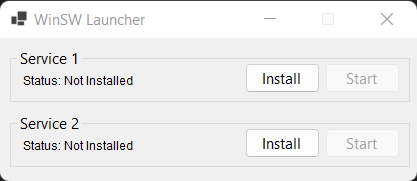

# WinSWLauncher
Launcher for popular [WinSW](https://github.com/winsw/winsw) service wrapper. 
<br /><br />


## Features
1. Easily install, uninstall, start and stop WinSW service wrapper
2. Support for multipple WinSW services 
3. Coztumizeable via Json Configuration

## Configuration
update <strong>appconfigs.json</strong> to customize WinSWLauncher
```
{
  "title": "WinSW Launcher", // Form Title
  "services": [
    {
      "display": "Service 1", // service display name in form
      "path": "$base\\service-1.exe", // winsw.exe path. $base for relative path
      "serviceName": "service-1-id" //WinSW service id 
    },
    {
      "display": "Service 2",
      "path": "$base\\service-2.exe",
      "serviceName": "service-2-id"
    }
  ]
}
```
To change form icon change <strong>app.ico</strong> file with your desired icon

